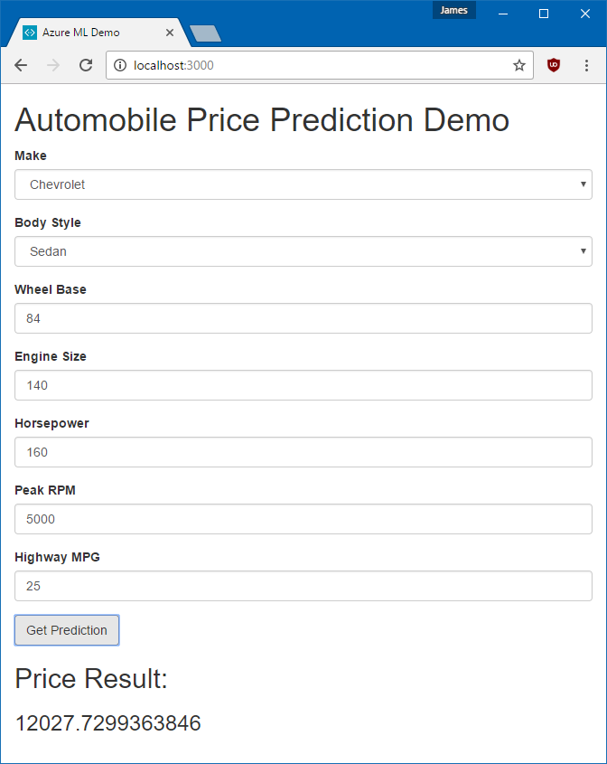

# Azure Machine Learning with Node/Vue.js webapp hands-on-lab

## Steps

1. [Make an Azure Machine Learning Experiment](STEP1.md)
2. [Deploy an Azure Machine Learning web service](STEP2.md)
3. [Make a webapp with Node.js and Vue.js which communicates with the web service](STEP3.md)
4. [Deploying the webapp to Azure (if time permits)](STEP4.md)

## Final Product

A web app which can take in user input with car data and return a price prediction.

