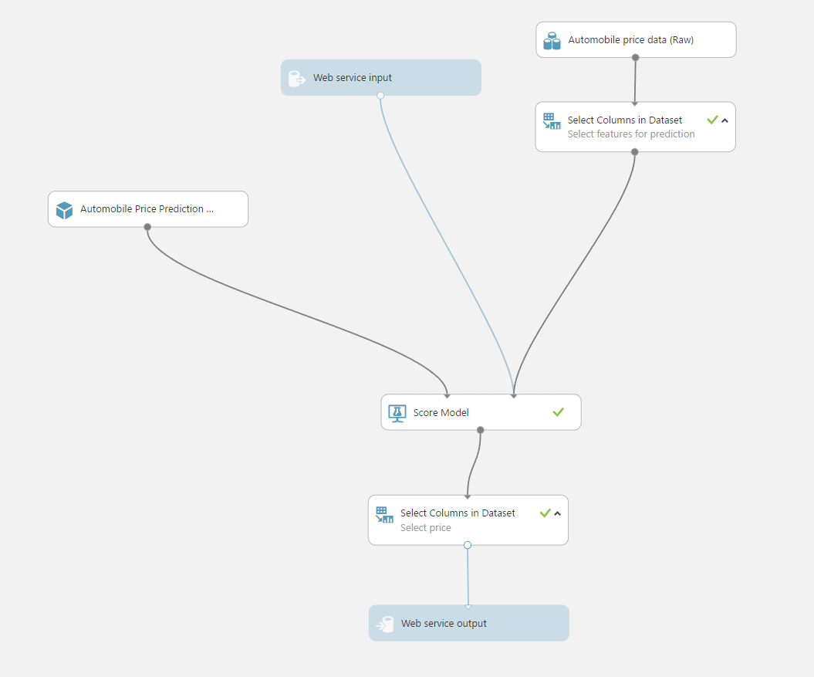
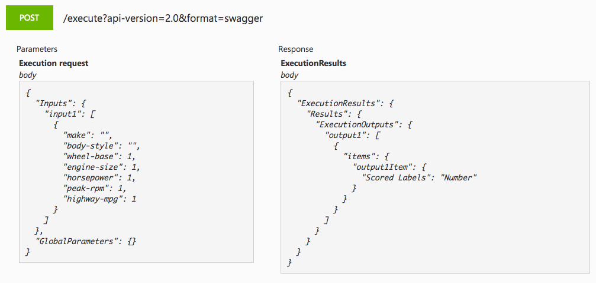

# 2. Deploy an Azure Machine Learning web service

In this step, we will deploy the experiment we made as a web service.

For the purposes of this HOL, we will be using the "new" web service and not the classic one.

[Guide Link](https://github.com/Microsoft/azure-docs/blob/master/articles/machine-learning/machine-learning-publish-a-machine-learning-web-service.md)

After converting your training experiment to a predictive experiment, your predictive experiment should be modified to look like this: (before deploying the web service)

The reason we modify the predictive experiment is so that our web service only takes in relevant information about the car and returns the price predicted by the model.

Our web service/API should end up looking like this:

After deploying your web service successfuly, there will be 2 key pieces of information we need to connect to it:

1. The web service URL
2. The API access key

Remember to take note of this information!

### [Next Step](STEP3.md)